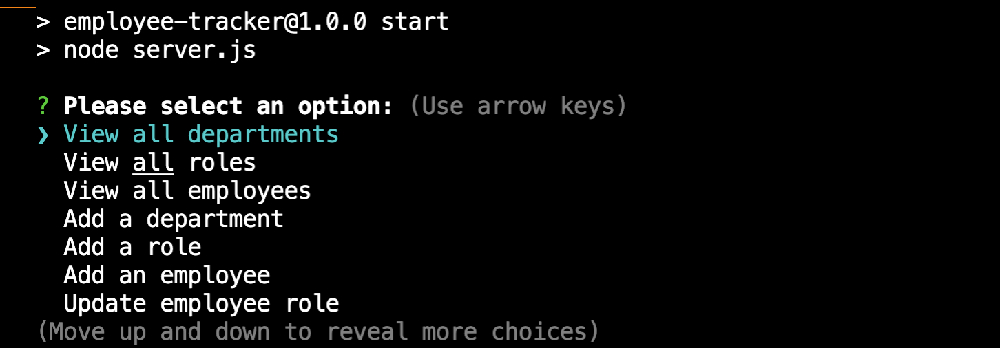

# Employee-Tracker

## Purpose

The purpose of this project was to create a command-line application that allows the user to manage a company's employee database using Node.js, inquirer and MySQL. With this application, the user is able to view and manage the departments, roles, and employees.

## Installation and Usage

1. Install node.js
2. Clone or download the source code from GitHub to your local machine:

```shell
git@github.com:jojochun/Employee-Tracker.git
```

3. Navigate to the root of the downloaded code:

```shell
cd employee-tracker
```

4. To install required dependencies (npm uuid), open terminal and on command line enter:

```shell
npm install
npm install inquires
npm install mysql2
npm install console.table
```

5. To start the server, on the command line enter:

```shell
npm start
```

## Screenshot



## Video Walkthrough

[Video walkthrough](https://drive.google.com/file/)

## Built With

HTML

CSS

Javascript

## Technologies

Node.js

Inquirer.js

npm

mysql2

## License

[](https://opensource.org/licenses/MIT)

## Contribution

Made with ❤️ by Joanne Chun
